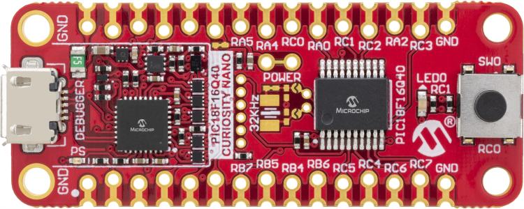
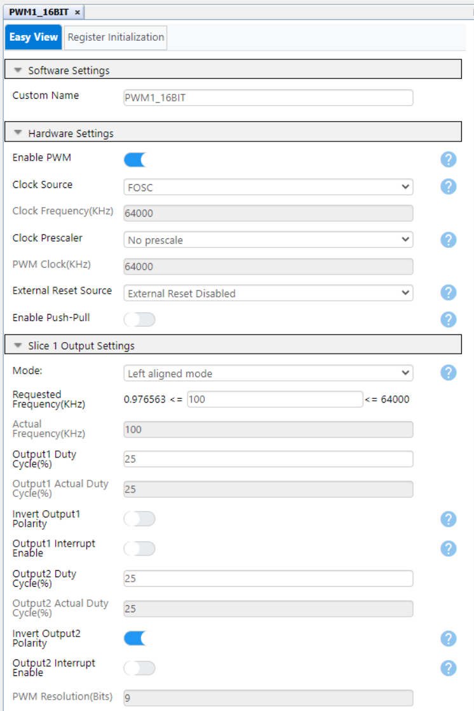
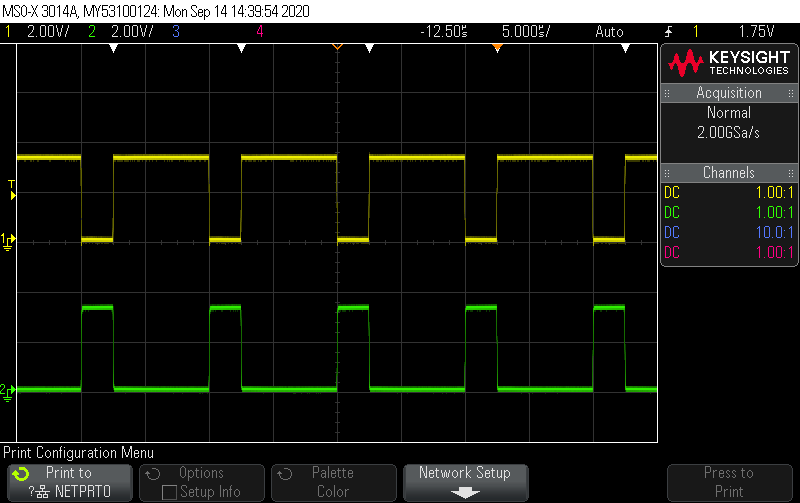
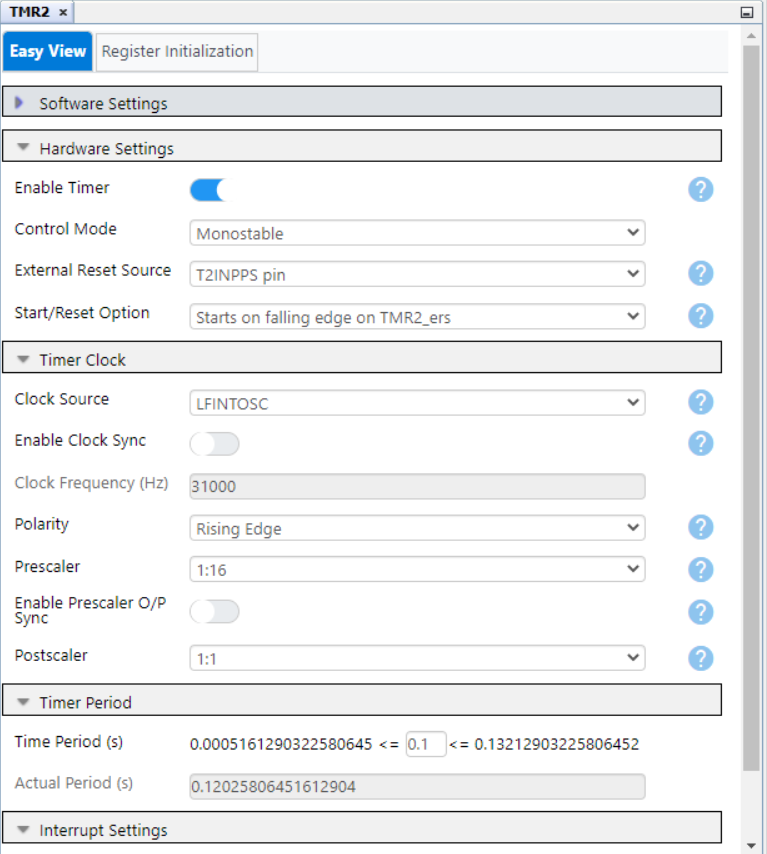
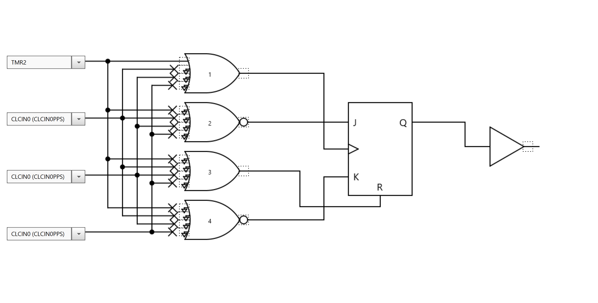

<!-- Please do not change this html logo with link -->
<a href="https://www.microchip.com" rel="nofollow"></a>

# PIC18F16Q40 Curiosity Nano Demonstration Firmware
The PIC18F16Q40 Curiosity Nano Evaluation Kit is preprogrammed with this project in order to demonstrate some of the key features of the device family. This project highlights several of the main peripherals found on the PIC18F16Q40 such as the ADC with Computation (ADCC), the Temperature Indicator module, Configurable Logic Cell (CLC), Non-Volatile Memory (NVM) module, 16-bit Pulse with Modulation (PWM), Universal Asynchronous Receiver/Transmitter (UART), and Timer 1/2 modules.

</a>

## Related Documentation
* [PIC18F16Q40 Curiosity Nano User Guide](https://microchip.com/DS50003047A)
* [PIC18F16Q40 Device Page](https://www.microchip.com/wwwproducts/en/PIC18F16Q40)

## Software Used:
  - [MPLAB® X IDE 6.10 or newer](http://www.microchip.com/mplab/mplab-x-ide)
  - [MPLAB® XC8 2.41 or a newer compiler](http://www.microchip.com/mplab/compilers)
  - [MPLAB® Code Configurator (MCC) 5.3.7 or newer](https://www.microchip.com/mplab/mplab-code-configurator)
  - [MPLAB® Melody Library 2.6.1 or newer](https://www.microchip.com/en-us/tools-resources/configure/mplab-code-configurator/melody)
  - [Microchip PIC18F-Q Series Device Support (1.20.405) or newer](https://packs.download.microchip.com/)

## Hardware Used
  - [PIC18F16Q40 Curiosity Nano](https://www.microchip.com/en-us/development-tool/EV70C97A)

## Setup
A brand new PIC18F16Q40 Curiosity Nano comes with the code (in this repository) pre-programmed onto the device. This demo code can be reprogrammed to the PIC18F16Q40 by copying the hex file onto the virtual drive that shows up once the Curiosity Nano board is plugged into a PC. The entire project can also be accessed using MPLABX 5.40 or newer.

## Operation
Upon start-up in this code example, the UART module is used to display an introduction message before moving into the main application loop. After the introduction has been displayed on the serial port, the ADCC is then used to periodically measure the device temperature using the Temperature Indicator module. The device temperature (in degrees Celsius) is printed using the UART module every 500 ms. At any time during operation, the push button labeled SW0 on the Curiosity Nano can be used to toggle LED0. Any time SW0 is pressed, the state of LED0 will change and a message will be printed via UART indicating that the button was pressed. Additionally, the PWM1 module is configured in this code example to drive pins RA4 and RA5.

### Using the ADCC and Temperature Indicator Modules to Measure Device Temperature
In this code example, the ADCC is used alongside the Temperature Indicator module to measure the device temperature periodically. The ADCC was configured using MCC in basic mode with Timer1 as the auto-conversion trigger (500 ms period) and the Fixed Voltage Reference (FVR) module was selected as the ADC Positive Reference Voltage. To use the temperature indicator module, the FVR Buffer 1 Gain was programmed to be 2.048V (2x), the TSEN bit was set to enable the Temperature Sensor, and the Temperature Sensor voltage range selected was the High-Range. The ADC Positive Channel (ADPCH) selected was the dedicated temperature indicator channel (channel_Temp). The following figure shows the ADCC configuration using MCC:

</a>

To calculate the device temperature (in degrees Celsius) using the acquired raw ADC conversion result, a compensation formula (which is described in the device data sheet) is required. The formula uses the raw ADC conversion result, along with a few parameters that are available in the Device Information Area (DIA) table and accessible by reading the specified areas in flash. The code snippet below shows the routine used in this demonstration. The Memory module in MCC was added to this project to generate the APIs that were used to read the Temperature Indicator parameters from the DIA table. Please refer to the device data sheet for more information.

```c
void TempIndicator_Calc(void) {
    adcc_meas = ADCC_GetConversionResult();
    tempC = (int24_t) adcc_meas * gain;
    tempC = tempC / 256;
    tempC = tempC + offset;
    tempC = tempC / 10;
    printf("Temp Sensor Result %d \r\n", tempC);
}
```

### 16-bit PWM Demonstration
The 16-bit PWM was configured in this project to generate an output frequency of 100 kHz with a duty cycle of 25% using MCC. The 16-bit PWM allows for dual outputs and the polarity of each output can be controlled as well. The PWM1 Output 1 was programmed to be on pin RA4 and PWM Output 2 is located on pin RA5. The PWM outputs on both of these pins are identical, with the exception that Output 2 on RA5 is inverted. The 16-bit PWM module is a core independent peripheral and pins RA4 and RA5 are continually driven in this code example without any CPU utilization. The following figures show the PWM configuration in this code example using MCC and the resulting output waveforms on pins RA4 and RA5.

</a>

</a>

### Core Independent Hardware Debouncing
As previously mentioned, the push button labeled SW0 can be used in this demonstration to toggle the state of LED0. A core independent hardware debouncer was implemented in this project using the CLC and Timer2 peripherals. Timer2 was configured in monostable mode with a period of around 100 ms and an external reset source on the T2INPPS pin, which was tied to pin RC0 where SW0 is located. Configuring Timer1 this way means that any time SW0 is pressed and a falling edge is detected on the T2INPPS pin, the timer will reset and count to 100 ms before stopping again. CLC1 was configured as a JK flip-flop where the J and K inputs are always tied high and the clock is tied to TMR2. When SW0 is pressed and Timer1 is restarted, once the 100 ms are complete, the JK Flip-Flop output will change which will result in an interrupt that can be used to accurately detect a button-press in software. The figures below show the MCC setup and configuration of both Timer2 and CLC1 as used in this hardware debouncer system.

</a>

</a>
